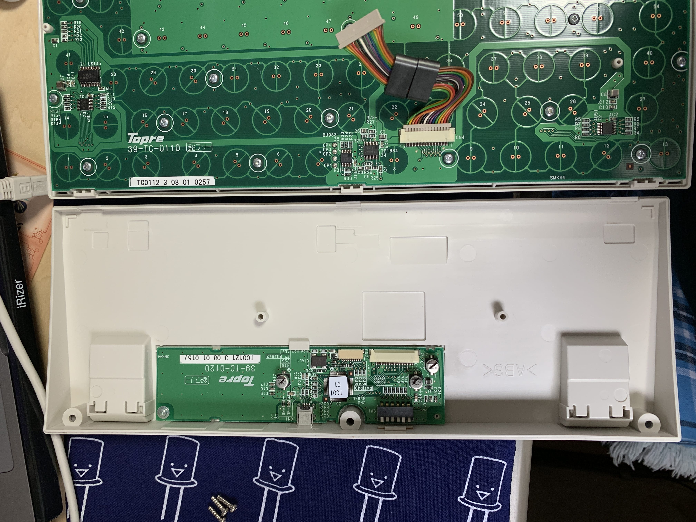
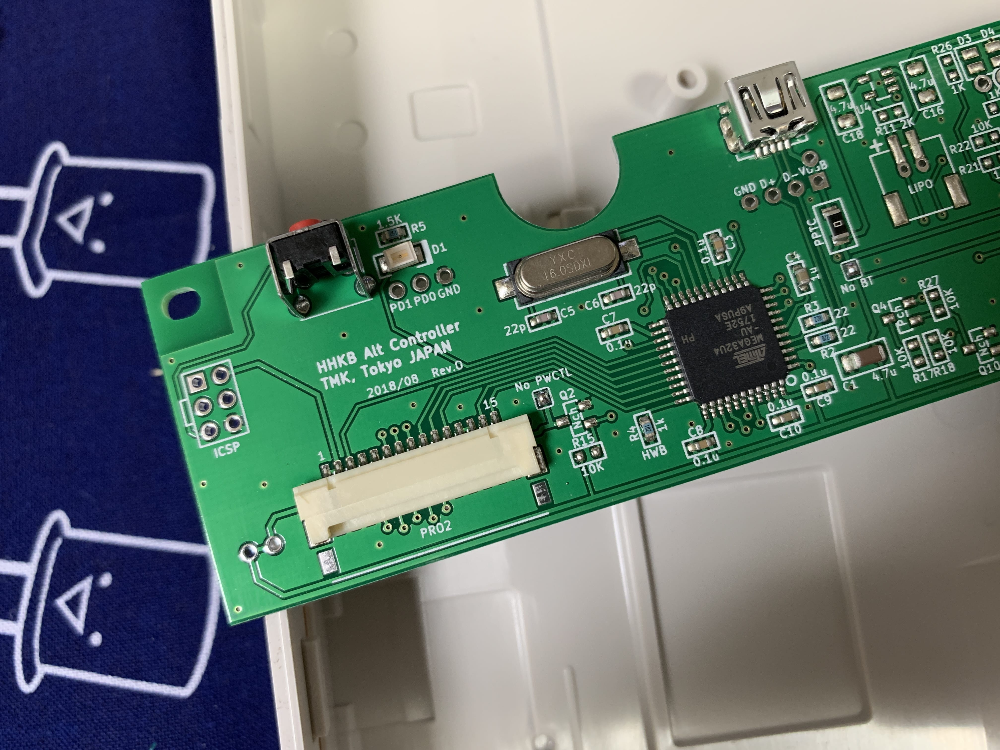

# Keyboard Configurations
## Keyboard.io Model 01-Q

I use a Mac laptop, with a Japanese keyboard, so I'm not only getting used to US positioning on the Model 01, but also just the general difference of having thumb keys. 

See the Arduino sketch (the `.ino` file) and the [Keyboard Layout Editor](http://www.keyboard-layout-editor.com/) raw file in the `Model01` folder of this repository. 

Here are a few points to make about the latest iteration of this layout:

* esc moved to upper left prog key, and put left option where esc was
* tab moved to physical pgup
* shifts on pinkies
* pgup, pgdn, home, end on fn n,m,comma,period
* backspace on physical num
* numlock is fn-any
* added macro to turn off led effect and assigned to fn-led
* added macro to toggle language IME between English and Japanese, assigned to any
* added a bunch of typically used cmd-x keys to left function, to make it easier to reach them

Latest Keyboard Layout Editor layout is [here](http://www.keyboard-layout-editor.com/#/gists/b5ba357ef4208fa8c804869a0808998e).

## HHKB Professional JP Type-S with Custom TMK Controller Board

I installed the TMK [programmable controller](https://geekhack.org/index.php?PHPSESSID=mpjsj3oieehhhl0iig80oskbh51le0g7&topic=71517.0) into my PFU HHKB Happy Hacking keyboard, and it works a treat. 

The steps to set up are: 

* Do a basic test to make sure the board basically works
* Create your map [online](http://www.tmk-kbd.com/tmk_keyboard/editor/unimap/?hhkb_jp). 
* Download the resultant `unimap.hex` file from that same page. 
* Switch the 'board into program mode using the red button on the controller (where the dip switches were). 
* Install `dfu-programmer` if it not already. 
* Do:
   * `dfu-programmer atmega32u4 erase --force`
   * `dfu-programmer atmega32u4 flash unimap.hex` 
   * `dfu-programmer atmega32u4 reset`

After that, it just works. I put an English keycap set on this originally Japanese keyboard, so that I can have arrow keys, since PFU does not sell an English HHKB with them. Many thanks to Hasu!

